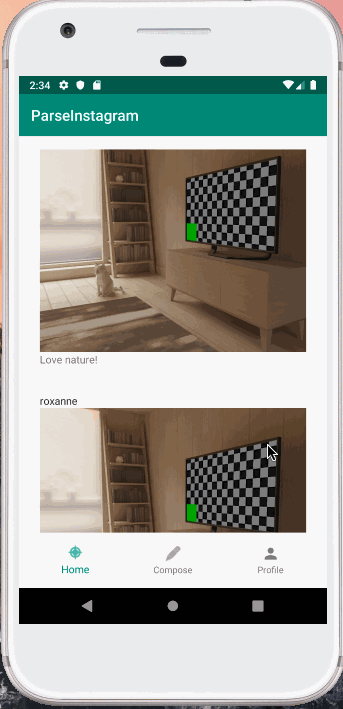

# Project 3 - *Parse Instagram*

**Parse Instagram** is an android app that allows users to utilize an Instagram-like application to post pictures with captions using a Parse backend.

Submitted by: **M. Flynn**

Time spent: **19** hours spent in total

## User Stories

The following **required** functionality is completed:

* [x] User can **sign up to create a new account using Parse authentication**
* [x] User can **log in and log out of his or her account**
* [x] The current signed in user is **persisted across app restarts**
* [x] User can **take a photo, add a caption, and post it to "Instagram"** 
* [x] User can **view the last 20 posts submitted to "Instagram"** 
* [x] User can **switch between different tabs using fragments and a Bottom Navigation View** 
* [x] User can **pull to refresh the last 20 posts submitted to "Instagram"** 

## Video Walkthrough

Here's a walkthrough of implemented user stories:

GIF created with [LiceCap](http://www.cockos.com/licecap/).
